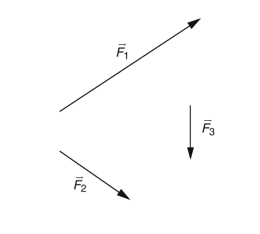
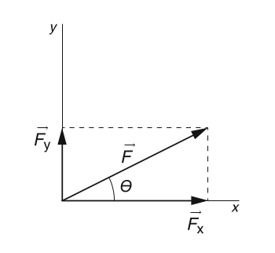
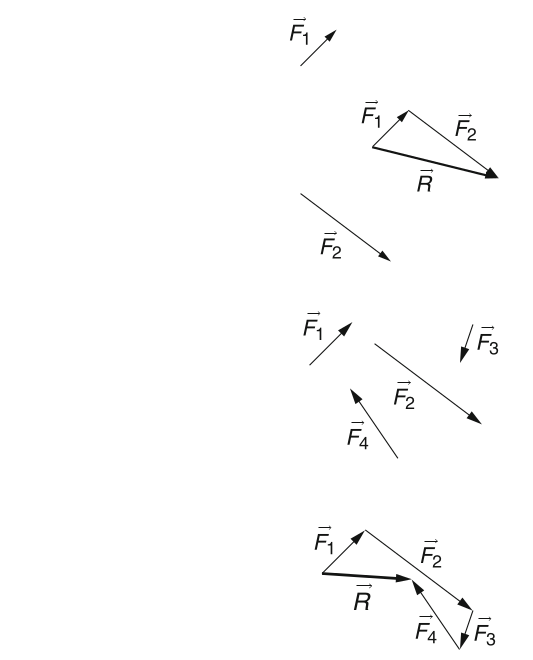
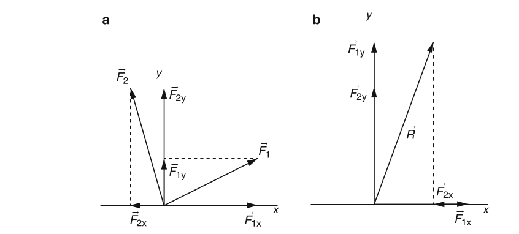
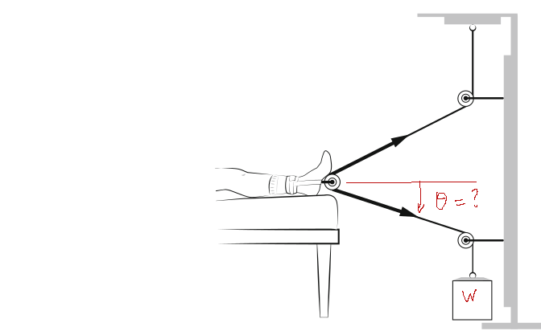

#+TITLE: BME Lecture 1: Force
#+AUTHOR: Fethi Okyar
#+DATE: 2024-02-19
#+SUBTITLE: Readings from Okuna, Chapter 1
#+STARTUP: overview
#+REVEAL_THEME: simple
#+REVEAL_INIT_OPTIONS: slideNumber:"c/t", width:1920, height:1080
#+REVEAL_TITLE_SLIDE: <h2>%t</h2> <h3>%s</h3> <h4>%d</h4>
#+OPTIONS: timestamp:nil toc:1 num:nil
#+REVEAL_EXTRA_CSS: ../style.css
#+REVEAL_ROOT: https://cdn.jsdelivr.net/npm/reveal.js

* Why does this course exist?
The *first course in Biomechanics* offered by the Biomedical Engineering Department aims to enhance the understading of the science of motion and the concept of force, although only the motion of rigid bodies, and a very brief introduction into deformable bodies and their motion.

#+ATTR_REVEAL: :frag (appear)
The acquired skills and knowledge include,
#+ATTR_REVEAL: :frag (appear appear appear ...)
- performing algebraic manipulation of vectors
- drawing isolated body equilibrium diagrams
- solve systems of linear equations for mechanical unknowns
- describe the state of stress in a body under static loading
  
* Course conduct
Course is composed of a few activities,
#+ATTR_REVEAL: :frag (appear appear appear ...)
- Lectures
  #+ATTR_REVEAL: :frag (appear appear appear ...)
  + Listening and taking notes in the lecture
  + Preparation for lectures using *openAI* if study questions were provided
- Attendence through Yulearn check-in
- Quizzes
  #+ATTR_REVEAL: :frag (appear appear appear ...)
  + *Github classroom*
  + In-class delivery
- Midterms
- Final

** Lectures
#+ATTR_REVEAL: :frag (appear appear appear ...)
- The board, projector, and supplementary materials will be utilized.
- _Asking questions_, and _taking notes_ are encouraged.
- The lecture notes are shared on Yulearn.
  #+ATTR_REVEAL: :frag (appear appear appear ...)
  + Contents of ~README.org~, and ~README.html~ are same, but presented differently. In lectures, ~README.html~ is projected, and you can read the content of ~README.org~ in the corresponding repository page.
  + For example, the documentation of the first week's lecture will be ~Spring2024-ES117-4-6/lecture-1/README.org~ and ~Spring2024-ES117-4-6/lecture-1/README.html~

** Quizzes
Three quizzes, half-an-hour with a single question each, will be given during the one-hour lecture during the semester.

** Midterm
This will be a two-hour exam.

* How to get updates about this course?
#+ATTR_REVEAL: :frag (appear appear appear ...)
- Yulearn course page
- OBS course announcements

* Concept of a Force
#+ATTR_REVEAL: :frag (appear appear appear ...)
- A force is merely an abstraction of the mechanical effect bodies exert upon each other.
- It is the mathematical "abstraction" of a physical ocurrence.
- It is one of the main actors in the field of mechanics.
- Others are - *moment*, *traction*, *stress*, *strain*, etc.
** Preliminaries
*** Units
What is the unit of force?
#+ATTR_REVEAL: :frag (appear appear appear ...)
- The fundamental units required to define the unit of force are the following
  #+ATTR_REVEAL: :frag (appear appear appear ...)
  + Length [L]
  + Mass [M]
  + Time [T]
- International System of Units, Newton, dyne, etc.
- Anglo-saxon System of Units, lb-f
- the formal definition will be given after visiting Newton's laws
** Force Vectors
*** Symbolic Representation of Vectors
A force is usually represented with an uppercase case letter with a right arrow over it:
$$ \vec{F} $$
or a tilda symbol as in:
$$ \tilde{F} $$ 
*** Graphical Representation of Vectors
#+ATTR_HTML: :width 600px

*** Notion of Coordinates
#+ATTR_REVEAL: :frag (appear appear appear ...)
- Coordinate systems (linear, orthogonal, polar, spherical, curvilinear, etc)
- measuring position
- measuring force
*** Vector Components
#+ATTR_HTML: :width 500px
#+ATTR_HTML: :style align:center

Various formulas involving trigonometric functions can be generated
$$ \tan\theta = \frac{F_y}{F_x} $$
$$ \sin\theta = \frac{F_y}{F} $$
etc.
*** Vector Algebra
#+ATTR_REVEAL: :frag (appear appear appear ...)
- negation
- multiplication by a scalar
- commutative property of addition
- distributive property of addition
*** Force Resultant
#+ATTR_HTML: :width 800px
#+ATTR_HTML: :style align:center

*** Adding by Components
#+ATTR_HTML: :width 1000px
#+ATTR_HTML: :style align:center

*** Exercise 1.1
Find the resultant force applied to the patient's leg by the traction device as a function of angle $\theta$ and the hanging weight.
#+ATTR_HTML: :width 1000px
#+ATTR_HTML: :style align:center

* questions for next session
Ask AI:
- to describe the role of vector algebra in Newtonian mechanics
- Is this the only way to express the fundamental laws of mechanics? Is there any alternative?
* Deliverables
Students should be able to:
1. provide the relative position vector from a point P to a point Q.
2. find the unit vector that points in the direction of a given vector.
3. write the force vector for a cable sustaining a given tension, T.
4. solve for equilibrium of a planar concurrent system of forces.
