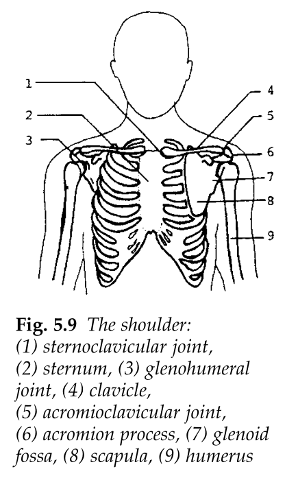
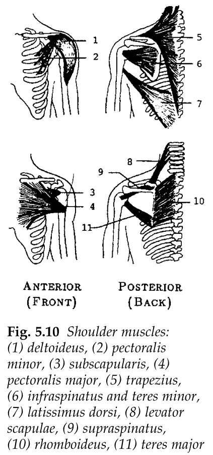
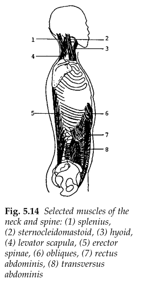
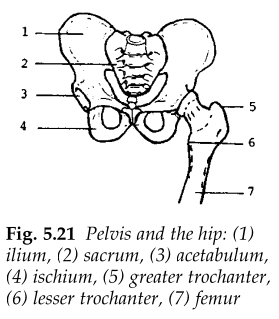
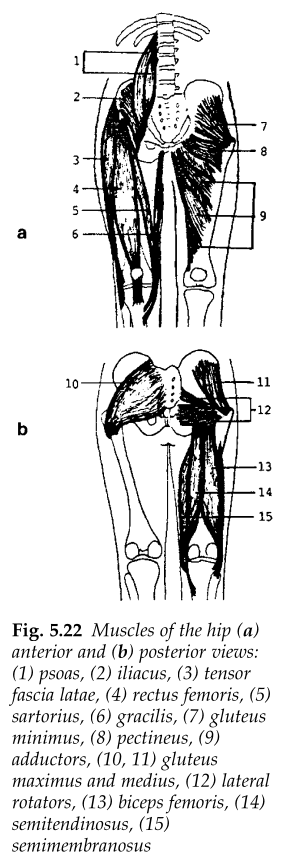

#+TITLE: BME Lecture 9: The Shoulder and the Spine
#+AUTHOR: Fethi Okyar
#+DATE: 2024-04-29
#+SUBTITLE: Readings from [[https://yulearn.yeditepe.edu.tr/mod/resource/view.php?id=215172][Özkaya et al., Chapter 5]]
#+STARTUP: overview
#+REVEAL_THEME: simple
#+REVEAL_INIT_OPTIONS: slideNumber:"c/t", width:1920, height:1080
#+REVEAL_TITLE_SLIDE: <h2>%t</h2> <h3>%s</h3> <h4>%d</h4>
#+OPTIONS: timestamp:nil toc:1 num:nil
#+REVEAL_EXTRA_CSS: ../style.css
#+REVEAL_ROOT: https://cdn.jsdelivr.net/npm/reveal.js

* From the last lecture
#+ATTR_REVEAL: :frag (appear)
Ask *AI*:
#+ATTR_REVEAL: :frag (appear appear appear ...)
- Define joint stability and the ways to inrease it.
- Why is the shoulder joint usually considered to be less stable among others?
  
* The Shoulder
The complex structure can be divided into two parts: the shoulder joint and the shoulder girdle.
#+ATTR_REVEAL: :frag (appear)
 - The bones and muscles that are part of this, as well as,
 - The movements resulting from this,
will be examined.

#+REVEAL: split
  #+ATTR_HTML: :width 400px
   

#+REVEAL: split
  #+ATTR_HTML: :width 400px
   

** the shoulder joint
- The shoulder joint (a.k.a the glenohumeral articulation)
  #+ATTR_REVEAL: :frag (appear appear appear ...)
  + the nearly hemispherical humeral head (ball) and the concave glenoid fossa of the scapula (socket)
  + stability is provided by the glenohumeral and coracohumeral ligaments and the muscles crossing the joint

*** movements of the shoulder joint
Three major motions are:
#+ATTR_REVEAL: :frag (appear appear appear ...)
- in the saggital plane:
  #+ATTR_REVEAL: :frag (appear appear appear ...)
  + flexion/extension
- in the coronal (frontal) plane:
  #+ATTR_REVEAL: :frag (appear appear appear ...)
  + abduction/adduction
- in the transverse plane:
  #+ATTR_REVEAL: :frag (appear appear appear ...)
  + inward/outward rotation
    
** The shoulder girdle
The complex structure that supports the shoulder joint
 #+ATTR_REVEAL: :frag (appear appear appear ...)
  + consists of the scapula and the clavicle
  + the acromioclavicular joint
  + the sternoclavicular joint
  + the scapulathoracic articulation and the scapulocostal joint

*** movements of the shoulder girdle
Four major motions are:
#+ATTR_REVEAL: :frag (appear appear appear ...)
- in the coronal (frontal) plane:
  #+ATTR_REVEAL: :frag (appear appear appear ...)
  + elevation/depression
  + upward/downward rotation
- in the transverse plane:
  #+ATTR_REVEAL: :frag (appear appear appear ...)
  + protraction/retraction
  + forward/backward rotation

** an example problem
#+ATTR_REVEAL: :frag (appear)
A person strengthening the shoulder by means of dumbbell exercise:
#+ATTR_REVEAL: :frag (appear appear appear ...)
+ 
  #+ATTR_HTML: :width 500px
   

#+REVEAL: split
  #+ATTR_HTML: :width 500px
   

write down the equations of motion (static equilibrium equations)

#+REVEAL: split
For a woman of height 165 cm and weight 57 kg, solve the unknowns using the table of antropometric data below, when she is lifting a 5-kg dumbbell.

* The Spine (Thursday lecture)
#+ATTR_HTML: :width 250px

#+ATTR_REVEAL: :frag (appear)
1. cervical
2. thoraric
3. lumbar
4. sacrum

#+REVEAL: split
Two particularly important joints of the spinal column are those with the head (occiput bone of the skull) and the first cervical vertebrae, atlas, and the atlas and the second vertebrae, the axis.
#+ATTR_REVEAL: :frag (appear)
- The /atlantooccipital/ joint is the union between the first cervical vertebra (the atlas) and the occipital bone of the head. This is a /double condyloid/ joint and permits movements of the head in the sagittal and frontal planes.
- The /atlantoaxial/ joint is the union between the atlas and the odontoid process of the head. It is a /pivot/ joint, enabling the head to rotate in the transverse plane.

** Muscles of the Spine
#+ATTR_HTML: :width 450px

** Skull example
#+ATTR_HTML: :width 500px

For a head weighing 50-N, estimate the angles $\theta$ and $\beta$ from the image and use these values to determine the muscle force, $F_M$ (that develops in the neck extensors) and the joint reaction force, $F_J$ (at the /atlantooccipital/ joint).

*** The normal and shear components at the joint
#+ATTR_HTML: :width 500px

The resolution of the joint reaction force into its /normal/ and /shear/ components is important for the evaluation of joint health. The contact plane needs to be identified in order to do this.

** Weight-lifter's spine example
#+ATTR_HTML: :width 450px

Assuming that the line of pull of the resultant muscle force exerted by the erector spinae muscles is parallel to the trunk (i.e., making an angle $\theta$ with the vertical), determine $F_M$ and $F_J$ in terms of $\theta$, given $a$, $b$, $c$, $W_0$, $W_1$, and $W$.

*** Free-body diagram of the lower portion
#+ATTR_HTML: :width 340px

* Mechanics of the Hip
#+ATTR_HTML: :width 450px

** Hip muscles
#+ATTR_HTML: :width 350px

** Single leg stance (lower fbd)
#+ATTR_HTML: :width 280px

#+REVEAL: split
#+ATTR_HTML: :width 400px

#+REVEAL: split
#+ATTR_HTML: :width 400px

$$F_M = \frac{(cW-bW_1)\cos\beta - a(W=W_1)\cos\alpha}{a(\cos\alpha\sin\theta - \sin\alpha\cos\theta)}$$

** Single leg stance (upper fbd)
#+ATTR_HTML: :width 280px

#+REVEAL: split
#+ATTR_HTML: :width 320px

$$F_M = \frac{\cos\phi\,W_2}{\sin(\phi-\theta)} $$

$$F_J = \frac{\cos\theta\,W_2}{\sin(\phi-\theta)} $$
* Questions for next session
Ask *AI*:
#+ATTR_REVEAL: :frag (appear appear appear ...)
- Comment about the effect of neglecting abdominal pressure on the joint reaction force at the L5-S1 joint?
* Deliverables
By the end of this lecture students should be able to:
#+ATTR_REVEAL: :frag (appear appear appear ...)
1. list the major motions at the shoulder
2. identify the joint reaction forces that develop at the two ends of the spine
3. list the major bones of the hip joint
