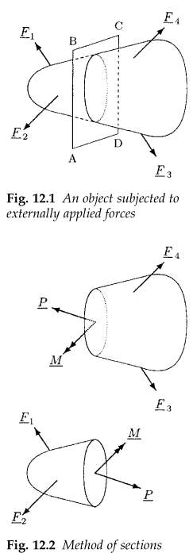

#+TITLE: BME Lecture 10: Basic Notions about Deformable Body Mechanics
#+AUTHOR: Fethi Okyar
#+DATE: 2024-05-07
#+SUBTITLE: Readings from [[https://yulearn.yeditepe.edu.tr/mod/resource/view.php?id=215167][Özkaya et al., Chapter 12]]
#+STARTUP: overview
#+REVEAL_THEME: simple
#+REVEAL_INIT_OPTIONS: slideNumber:"c/t", width:1920, height:1080
#+REVEAL_TITLE_SLIDE: <h2>%t</h2> <h3>%s</h3> <h4>%d</h4>
#+OPTIONS: timestamp:nil toc:1 num:nil
#+REVEAL_EXTRA_CSS: ../style.css
#+REVEAL_ROOT: https://cdn.jsdelivr.net/npm/reveal.js

* From the last lecture
#+ATTR_REVEAL: :frag (appear)
Ask *AI*:
#+ATTR_REVEAL: :frag (appear appear appear ...)
- Comment about the effect of neglecting abdominal pressure on the joint reaction force at the L5-S1 joint?

To be completed:
- Determine equilibrium variables $F_M$ and $F_J$ using geometric principle from upper FBD, compare the results with those from the lower FBD.
  
* Deformable Body Mechanics
#+ATTR_REVEAL: :frag (appear)
How and why do rigid bodies become deformable? 
#+ATTR_REVEAL: :frag (appear appear appear ...)
- let the distance between internal points be variable::STRAIN, $\varepsilon$
- investigate distribution and intensity of the load flow within::STRESS, $\sigma$
- by this way:
- solution of statically indeterminate problems become possible
- it also becomes possible to predict the design life of a man-made artifact,
- and to define a number of mechanical qualities of biological tissues, such as elastic and shear moduli, bulk modulus, all of which are a.k.a ``the CONSTITUTIVE PARAMETERS''.
  
** Internal Forces and Moments
#+ATTR_HTML: :width 300px

#+REVEAL: split
#+ATTR_REVEAL: :frag (appear)
Method of sections: 
#+ATTR_REVEAL: :frag (appear appear appear ...)
- Select a cutting plane with normal $\mathbf{n}$.
- Split the object into two halves, revealing the internal /traction/ distribution.
- *Traction* has the units of force per unit area.
- The /resultant/ force and moment are labeled as $\mathbf{P}$ and $\mathbf{M}$.
- The component of the force parallel to $\mathbf{n}$ is called the /normal/ component, labeled as $P_n$ or $P_\perp$.
- The remaining component can be found by $\mathbf{P}_\parallel = \mathbf{P} - P_\perp\,\mathbf{n}$. This is called the /tangential/ or the /shear/ component.
- The component of the moment parallel to $\mathbf{n}$, i.e. $M_n$ or $M_\perp$ is called the /twisting/ moment.
- The remaining part, $\mathbf{M}_\parallel = \mathbf{M} - M_\perp\,\mathbf{n}$ is called the /bending/ moment.

** Causality between Loading and Deformation
#+ATTR_REVEAL: :frag (appear)
A body is assumed to be in it's /reference/ *configuration* (state 0) while /unloaded/. 
#+ATTR_REVEAL: :frag (appear appear appear ...)
- Usually the markers used to measure deformation are subscripted by the $\Box_0$, e.g., $l_0$ denotes the original length of a segment, etc.
- As a result of loading the body assumes it's /deformed/ configuration (state 1). Usually the deformed lengths are denoted without subscripts, e.g., $l$ denotes the deformed length.

** Deformation Measure: Strain
#+ATTR_REVEAL: :frag (appear)
When deformed a body changes its /shape/ and/or /size/. Changes in shape and size are measured differently.
#+ATTR_REVEAL: :frag (appear appear appear ...)
- The change in *size* is also called as /dilatation/. The body preserves it's shape (a parallelpiped remains as a parallelpiped, etc.).
- *Normal strain* is defined as the relative change in any reference segment length, $l_0$. i.e. if the new segment length is $l$, the relative change in length (a.k.a. normal strain) is calculated as $(l-l_0)/l_0$. The difference between the reference and deformed length is called the elongation, $\delta=l-l_0$.
- 
- The change in *shape* is also called as /distortion/. The body may preserve it's size (volume) during distortion.
- *Shear strain* is defined as the /change in angle/ (measure in radians) between two line segments that were originally perpendicular in the reference configuration. 

** Constitutive Relations
#+ATTR_REVEAL: :frag (appear)
The mechanical response of bodies to load application may differ with the amount of loading, heat, and the amount of time exposed to loading.
$$ \sigma = f(\varepsilon, T, t) $$
#+ATTR_REVEAL: :frag (appear appear appear ...)
- Various models are available
- Elastic
  $$ \sigma \propto \varepsilon $$
- Viscoelastic
  $$ \sigma \propto \dot{\varepsilon} $$
- Poroelastic, etc.
- The constants that appear in the above formulae are known as mechanical material properties.
- e.g. $E$, the elastic (or Young's) modulus appears as
  $$ \sigma = E \varepsilon $$
  

* Questions for next session
Ask *AI*:
#+ATTR_REVEAL: :frag (appear appear appear ...)
- N/A
* Deliverables
By the end of this lecture students should be able to:
#+ATTR_REVEAL: :frag (appear appear appear ...)
1. draw internal forces at a given cross-section through a body
2. define the notions of stress and strain in a body
3. explain the constitutive relations between stress and strain
