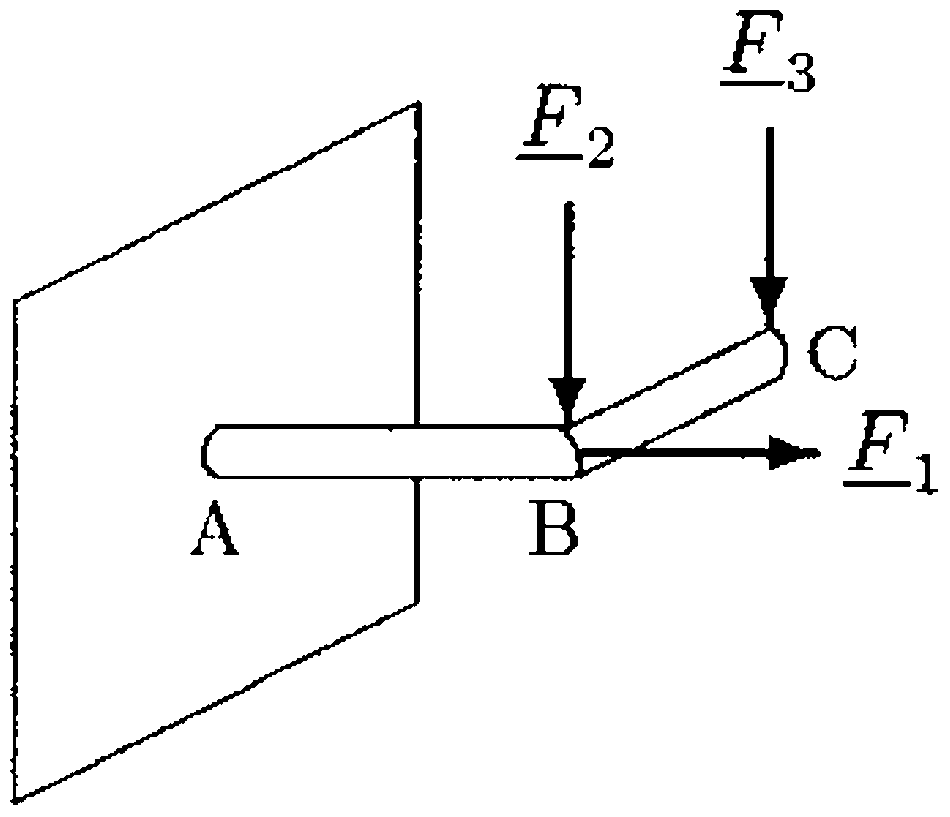
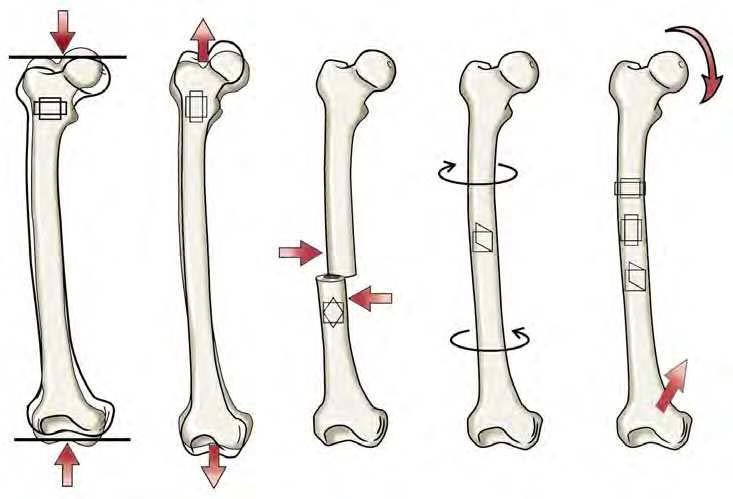
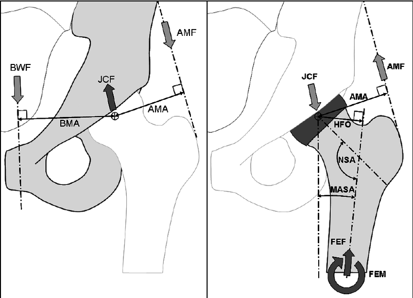
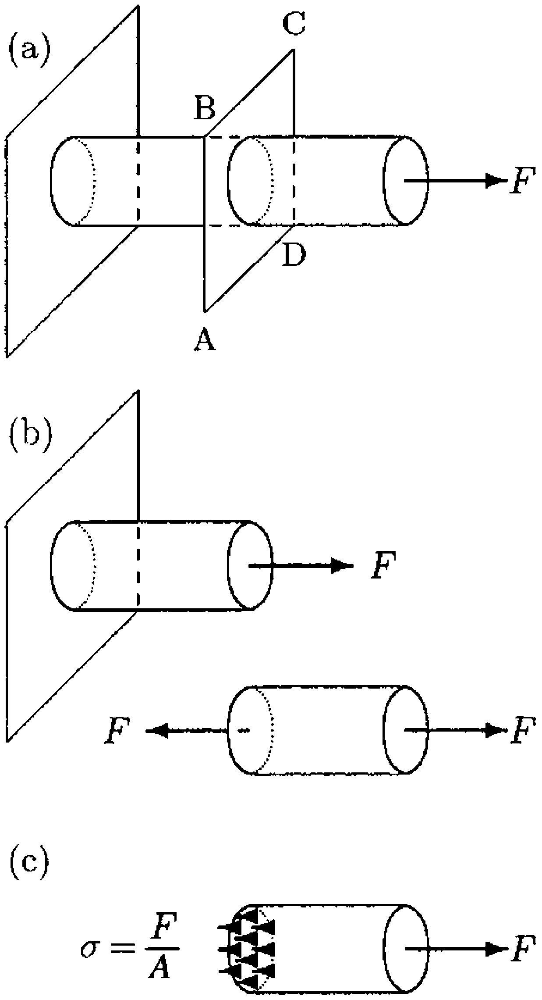
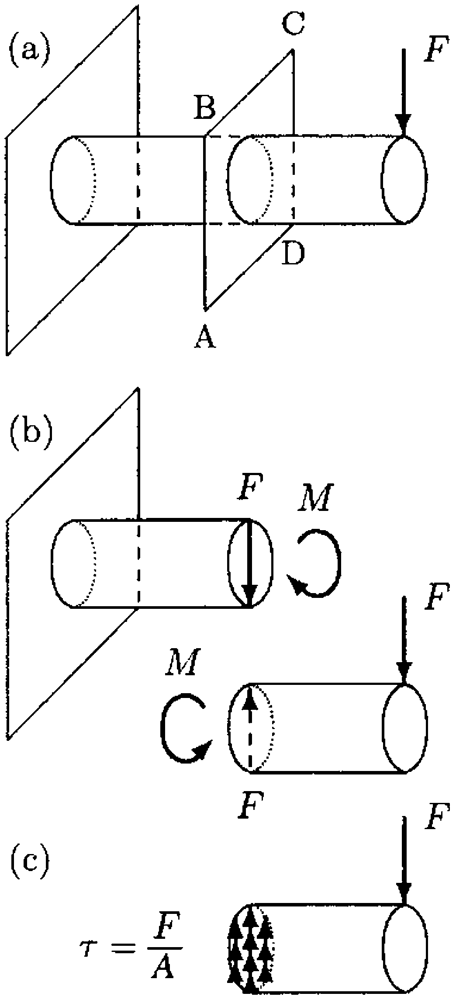

#+TITLE: BME Lecture 11: Internal Forces and Stresses
#+AUTHOR: Fethi Okyar
#+DATE: 2024-05-10
#+SUBTITLE: Readings from [[https://yulearn.yeditepe.edu.tr/mod/resource/view.php?id=215167][Özkaya et al., Chapter 13]]
#+STARTUP: overview
#+REVEAL_THEME: simple
#+REVEAL_INIT_OPTIONS: slideNumber:"c/t", width:1920, height:1080
#+REVEAL_TITLE_SLIDE: <h2>%t</h2> <h3>%s</h3> <h4>%d</h4>
#+OPTIONS: timestamp:nil toc:1 num:nil
#+REVEAL_EXTRA_CSS: ../style.css
#+REVEAL_ROOT: https://cdn.jsdelivr.net/npm/reveal.js

* From the last lecture
#+ATTR_REVEAL: :frag (appear)
Ask *AI*:
#+ATTR_REVEAL: :frag (appear appear appear ...)
- Basic notions about deformable body mechanics
  
* Internal Force Systems
#+ATTR_REVEAL: :frag (appear)
Forces and moments that are revealed based on the method of sectioning the body into two halves by a cutting plane.
#+ATTR_REVEAL: :frag (appear appear appear ...)
- Normal and shear forces
- Twisting and bending moments

** Internal forces in slender bodies
#+ATTR_HTML: :width 400px

#+ATTR_REVEAL: :frag (appear appear appear ...)
- Slender bodies are long and thin, and known to possess an inherent longitudinal axis.
- Internal forces in slender bodies are generally determined along their transverse planes (planes which are perpendicular to the longitudinal axis).
- In a biomechanical analysis support reactions are usually determined before internal forces   (point $A$).
- Determine the internal force system on a transverse plane midway between $BC$.
- Determine the internal forces midway between $AB$.
  

** Types of loads in slender bones
#+ATTR_HTML: :width 800px

#+ATTR_REVEAL: :frag (appear appear appear ...)
- The femur is a slender bone. It is subject to a variety of loading configurations as depicted above. 
- The internal force systems that arise as a results of these will be discussed.
- The types of fractures that may result from each of these loadings may be different.

** Internal force in the femur
#+ATTR_HTML: :width 800px

#+ATTR_REVEAL: :frag (appear appear appear ...)
- The internal force and moment that arise at a particular level of the femur may be determined after the JCF and AMF are determined.

* Internal Stresses
#+ATTR_REVEAL: :frag (appear)
- The previous approach to determine internal force systems may be termed as the /TOP-DOWN/.
- In this approach, we use the free-body diagram and the method of sections to determine  the internal force system.
- There is another approach which may be called the /BOTTOM-UP/.
- In the bottom-up approach the internal forces are viewed as the resultants of the traction distribution along the section.
- Internal traction (a.k.a. stress) is the force distributed per unit area along the section plane.
  $$ t_i = \lim_{\Delta A\rightarrow 0} \frac{\Delta F_i}{\Delta A}$$
  where $\Delta F_i$ is the force in direction $i$ carried in area $\Delta A$.
- The total internal force, $F_i$ carried over the entire section can be found by integrating the tractions, $t_i$ as
  $$ F_i = \int_A t_i \mathrm{d}A. $$
  
** Notion of Average Stress
#+REVEAL_HTML: 

#+ATTR_HTML: :width 400px

#+REVEAL_HTML: 

#+REVEAL_HTML: 

#+ATTR_REVEAL: :frag (appear appear appear ...)
- When the distribution $t_i(x,y)$ is uniform ($t_i(x,y)=c$), the centroid of the tractions coincides with the area centroid, $C$.
- In that case, the line-of-action of the resultant force, $F_i$, passes through the centroid.
- The reverse is also true: when the line-of-action of the external force is coincident with the centoidal axis of the body, the traction distribution will be uniform.
- In that case, we may write
  $$ \sigma = \frac{F}{A} $$
- $\sigma$ is termed as the normal stress because it is directed parallel to the section normal.
- Note that if an /eccentricity/, $e$, between the line of action of the force and the centroidal axis is introduced, then the traction distribution will cease to be uniform!
#+REVEAL_HTML: 

** Notion of Shearing
#+REVEAL_HTML: 

#+ATTR_HTML: :width 400px

#+ATTR_REVEAL: :frag (appear appear appear ...)
#+REVEAL_HTML: 

#+REVEAL_HTML: 

#+ATTR_REVEAL: :frag (appear appear appear ...)
- When there are external forces that are not aligned with the longitudinal axis, their components in the transverse plane are called as /shear/ forces.
- Internal moments equilibrating shear forces arise in this situation.
- The shear stress can be calculated assuming they are distributed uniformly over the section area as:
  $$ \tau = \frac{V}{A} $$
- while internal moments give rise to normal stresses that can be calculated by another formula:
  $$ \sigma = \frac{Mc}{I} $$
#+REVEAL_HTML: 

  
* Questions for next session
Ask *AI*:
#+ATTR_REVEAL: :frag (appear appear appear ...)
- What are the types of fracture in long bones and how are they related with the loading types?
- How would you explain the mathematical notion of stress, and in which  way is it different from a vector?
- Comment about the structural differences and similarities between the mechanical notions of strain and stress.
  
* Deliverables
By the end of this lecture students should be able to:
#+ATTR_REVEAL: :frag (appear appear appear ...)
1. determine the internal force system as a result of external loading in slender bodies
2. relate the normal and shear stress components with internal normal and shear forces.
3. associate various types of fractures in slender bars with loading types
