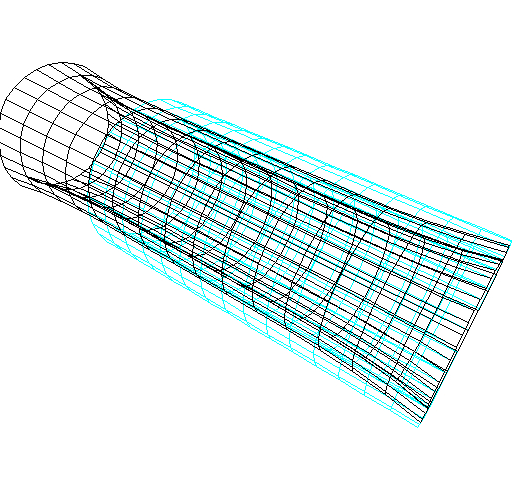
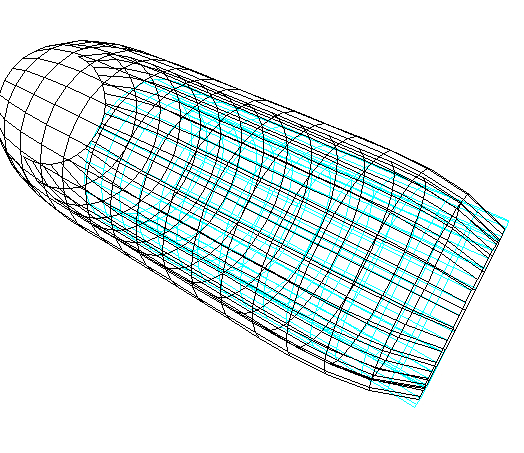
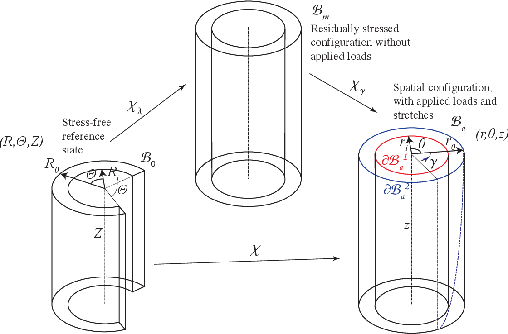
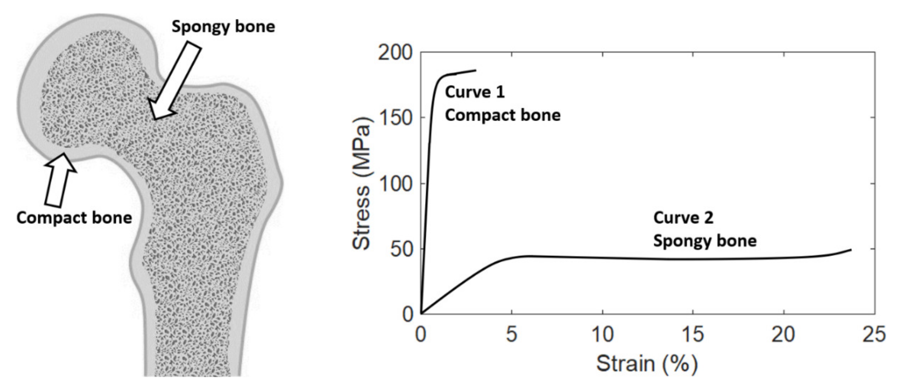
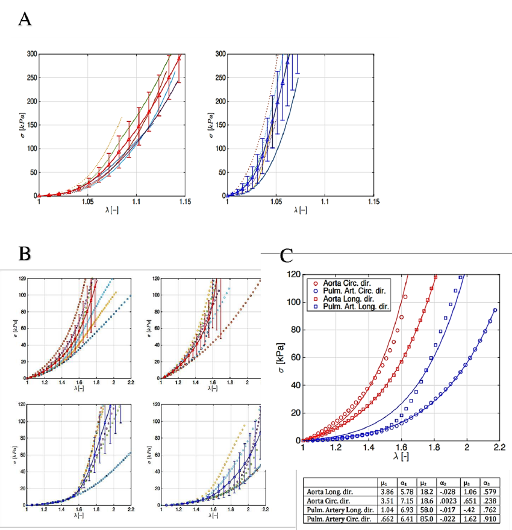
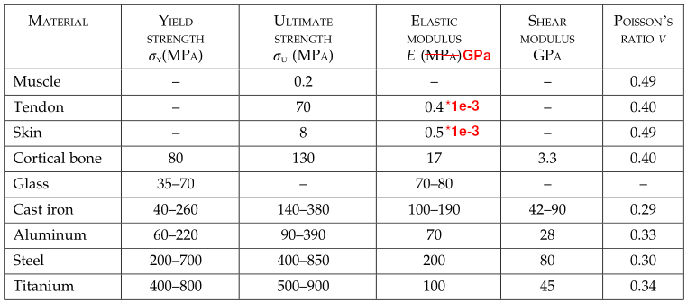

#+TITLE: BME Lecture 12: Definition and Measurement of Strains, Elastic Response
#+AUTHOR: Fethi Okyar
#+DATE: 2024-05-19
#+SUBTITLE: Readings from [[https://yulearn.yeditepe.edu.tr/mod/resource/view.php?id=215167][Özkaya et al., Chapter 13]]
#+STARTUP: overview
#+REVEAL_THEME: simple
#+REVEAL_INIT_OPTIONS: slideNumber:"c/t", width:1920, height:1080
#+REVEAL_TITLE_SLIDE: <h2>%t</h2> <h3>%s</h3> <h4>%d</h4>
#+OPTIONS: timestamp:nil toc:1 num:nil
#+REVEAL_EXTRA_CSS: ../style.css
#+REVEAL_ROOT: https://cdn.jsdelivr.net/npm/reveal.js

* From the last lecture
#+ATTR_REVEAL: :frag (appear)
Ask *AI*:
#+ATTR_REVEAL: :frag (appear appear appear ...)
- What are the types of fracture in long bones and how are they related with the loading types?
- How would you explain the mathematical notion of stress, and in which  way is it different from a vector?
- Comment about the structural differences and similarities between the mechanical notions of strain and stress.
  
* Simple (or Linear) Strain
#+ATTR_REVEAL: :frag (appear)
What is strain? How many types of strain are there and how are they related with stresses?
#+ATTR_REVEAL: :frag (appear appear appear ...)
- Strain is a mathematical means to measure the deformation, which is the change in  size (dilatation) and shape (distortion) of an object due to applied loads.
- For this purpose, two types of strain measures are used: normal and shear strains.
- Normal strains are related with normal stresses and shear strains are related with shear stresses.

** Normal Strain
#+REVEAL_HTML: 

#+ATTR_HTML: :width 400px

#+REVEAL_HTML: 

#+REVEAL_HTML: 

#+ATTR_REVEAL: :frag (appear)
A line segment is used to measure the normal strain. 
#+ATTR_REVEAL: :frag (appear appear appear ...)
- Two points are marked as $A$ and $B$ along the direction $n$ in which normal strain is sought in the unloaded state. This is the undeformed configuration.
- The segment $AB$ is known as the *gage length*, recorded as $l_0$.
- Upon the application of the load the body deforms. This is called the deformed configuration.
- The point $A$ moves to $A'$, and $B$ to $B'$. The new gage length $A'B'$ is recorded as $l$.
- The normal strain in the direction $n$ around $A$ and $B$ is found by
  $$ \varepsilon_n = \frac{A'B'-AB}{AB} = \frac{l-l_0}{l_0}$$
- There are other ways to quantify dilatational deformation such as the stretch ratio along a particular direction $n$, $\lambda_n$:
  $$ \lambda_n = \frac{l}{l_0} = \varepsilon_n + 1 $$
#+REVEAL_HTML: 

  
** Shear Strain
#+REVEAL_HTML: 

#+ATTR_HTML: :width 400px

#+REVEAL_HTML: 

#+REVEAL_HTML: 

#+ATTR_REVEAL: :frag (appear)
A line segment is used to measure the normal strain. 
#+ATTR_REVEAL: :frag (appear appear appear ...)
- Three points are marked as $A$, $B$ and $D$ along the perpendicular directions $n$ and $t$ in the unloaded state. 
- The angle $\widehat{BAD}$ is recorded as $\pi/2$.
- Upon the application of the load points $A$, $B$, and $D$ move to $A'$, $B'$ and $D'$. The new angle $\widehat{B'A'D'}$ between the deformed direction vectors $n'$ and $t'$ is recorded as $\theta$.
- The shear strain is measured as the difference between the original right angle $\widehat{BAD}$ and the new angle $\widehat{B'A'D'}$
  $$ \omega = \pi/2 - \theta $$
#+REVEAL_HTML: 

** Examples on a Circular Tube
#+ATTR_REVEAL: :frag (appear appear appear ...)
- Inflation
- Torsion

*** Inflation of a Tube
Deformation of a computational artery model under combined axial extension/inflation:
#+REVEAL_HTML: 

#+ATTR_HTML: :width 600px

#+REVEAL_HTML: 

#+REVEAL_HTML: 

#+ATTR_HTML: :width 600px

#+REVEAL_HTML: 

*** Torsion of a Tube
Deformation of a theoretical artery model under torsion:
#+ATTR_HTML: :width 1100px

* Material Strain Response to Stress
#+ATTR_REVEAL: :frag (appear)
In general, for biological tissues, we can separate the deformation response to mechanical loading to two types.
#+ATTR_REVEAL: :frag (appear appear appear ...)
- Those that can not deform significantly before losing their function and/or integrity
  + These are usually named as hard-biological tissues
  + Their initial response to stress is linear in strain, this is called the linear elastic behaviour
- Those that can sustain large amounts of deformation
  + These are usually called soft biological tissues
  + They are modeled by hyperelastic material models, or such.

** Hard Tissue: Bone
#+ATTR_HTML: :width 1000px

** Soft Tissue: Veins
#+ATTR_HTML: :width 900px

** Elastic Response
Nearly all materials show an elastic response at an /early/ (low) stage of loading.
#+REVEAL_HTML: 

#+ATTR_HTML: :width 400px

#+REVEAL_HTML: 

#+REVEAL_HTML: 

#+ATTR_REVEAL: :frag (appear appear appear ...)
- Body stores the work of forces as elastic strain energy
- Upon unloading this energy is converted into a restoring force that returns the body into its original shape
- For most materials, the elastic response is linear, but not for all (e.g. rubber, elastin fibers in biological tissues)
- Elasticity is characterized by the elastic modulus, $E$, which appears as the constant of proportionality between the normal stress, $\sigma$, and the normal strain $\varepsilon$
  $$ \sigma = E\, \varepsilon $$
- The response in shear is also elastic in the early stages of loading, i.e.,
  $$ \tau = G\, \gamma $$
  where $G$ is called the shear modulus (modulus of elasticity in shear).
#+REVEAL_HTML: 

** Table of Elastic Moduli
#+ATTR_HTML: :width 1000px

** Some Example Problems from Chapter 13
#+ATTR_REVEAL: :frag (appear appear appear ...)
- Example 13.1: Circular cylindrical rod with radius $r= 1.26$ cm is tested in a uniaxial tension test (Fig. 13.29). Before applying a tensile force of $F= 1000$ N, two points $A$ and $B$ that are at a distance $l_0= 30$ cm (gage length) are marked on the rod. After the force is applied, the distance between $A$ and $B$ is measured as $l= 31.5$ cm.
  #+ATTR_REVEAL: :frag (appear appear appear ...)
  + Determine the tensile strain and average tensile stress generated in the rod.
  + Assuming the behavior is elastic, determine the elastic modulus.
  + Based on the elastic modulus try to guess the rod material using Table 13.2.
  
* Questions for next session
Ask *AI*:
#+ATTR_REVEAL: :frag (appear appear appear ...)
- Under which conditions does a material portray elastic behavior?
- Is elastic model sufficient to characterize hard biological tissues? How about soft biological tissues? What is the role of viscoelasticity and poroelasticity in the characterization of soft tissue?
* Deliverables
By the end of this lecture students should be able to:
#+ATTR_REVEAL: :frag (appear appear appear ...)
1. measure normal and shear strains arising from the deformation at a point
2. convert stress/strain into one another given material's elastic properties
