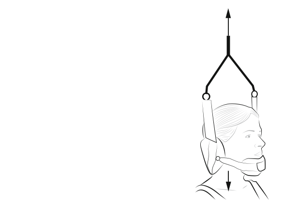
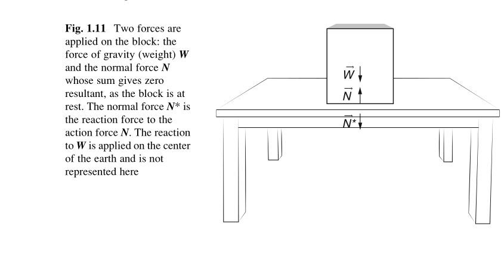
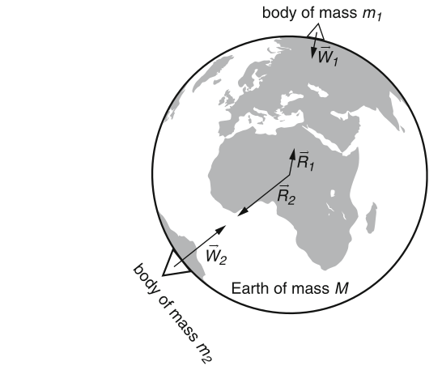
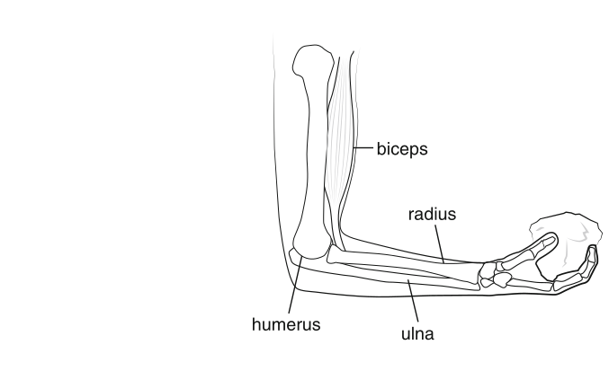

#+TITLE: BME Lecture 2: Newtonian Mechanics
#+AUTHOR: Fethi Okyar
#+DATE: 2024-02-29
#+SUBTITLE: Readings from [[https://yulearn.yeditepe.edu.tr/mod/resource/view.php?id=215168][Okuna, Chapter 1]]
#+STARTUP: overview
#+REVEAL_THEME: simple
#+REVEAL_INIT_OPTIONS: slideNumber:"c/t", width:1920, height:1080
#+REVEAL_TITLE_SLIDE: <h2>%t</h2> <h3>%s</h3> <h4>%d</h4>
#+OPTIONS: timestamp:nil toc:1 num:nil
#+REVEAL_EXTRA_CSS: ../style.css
#+REVEAL_ROOT: https://cdn.jsdelivr.net/npm/reveal.js

* From the last lecture
#+ATTR_REVEAL: :frag (appear)
Ask *AI*:
#+ATTR_REVEAL: :frag (appear appear appear ...)
- describe the role of vector algebra in Newtonian mechanics
- Is this the only way to express the fundamental laws of mechanics? Does an alternative exist?
  
* Newton's interpretation of the laws of dull motion
#+ATTR_REVEAL: :frag (appear appear appear ...)
1. The state of motionlessness or steady motion
2. Mass relating the force and acceleration
3. the result of physical interaction between two objects (bodies)
** Newton's first principle
States that ...
*** Equilibrium in concurrent force systems
#+ATTR_HTML: :width 900px
#+ATTR_HTML: :style align:center

A vertical upward traction force of 60 N, shown in the figure of Exercise 1.3, is applied on a head of a person standing straight. Suppose that the weight of the head is 45 N. Determine the resultant force on the head.
** Newt's second
States that ...
$$ \boldsymbol{a} = \frac{1}{m} \boldsymbol{F} $$
$$ \boldsymbol{a} = \lim_{\Delta t\rightarrow 0} \frac{\Delta \boldsymbol{v}}{\Delta t}  = \frac{\mathrm{d} \boldsymbol{v}}{\mathrm{d} t}  $$
*** the principle of conservation of linear momentum
$$ \frac{\mathrm{d} \boldsymbol{L}}{\mathrm{d} t} = \mathbf{F} $$
$$ \boldsymbol{L} = m \boldsymbol{v} $$
#+ATTR_REVEAL: :frag (appear)
allows us to solve problems like:
#+ATTR_REVEAL: :frag (appear appear appear ...)
*Exercise 1.4* What force should act on a ball of 0.6 kg mass, through a kick, to acquire an acceleration of 40 m/s$^2$?
** Newt's third
when two bodies physically interact with one another ...
ACTION brings an equal an opposite REACTION
*** identification of the reaction from a support
*Exercise 1.5* In high jumping, an athlete exerts a force of 3000 N = $3\times  10^3$ N = 3 kN against the ground during impulsion. Find the force exerted by the ground on the athlete. Discuss the nature of this force.
*** another example
#+ATTR_HTML: :width 1300px
#+ATTR_HTML: :style align:center

* Some Specific Forces
** Weight
*** 
#+ATTR_HTML: :width 900px
#+ATTR_HTML: :style align:center

** Muscle Forces
*** 
#+ATTR_HTML: :width 900px
#+ATTR_HTML: :style align:center

* Questions for next session
Ask *AI*:
- What is the effect of the force of friction in how we move around?
- which devices would not operate without friction?
* Deliverables
By the end of this lecture students should be able to:
1. apply the first law (equilibrium of a force system)
2. apply the principle of conservation of momentum
3. determine the normal and tangential reaction components
4. describe the nature of reaction forces
