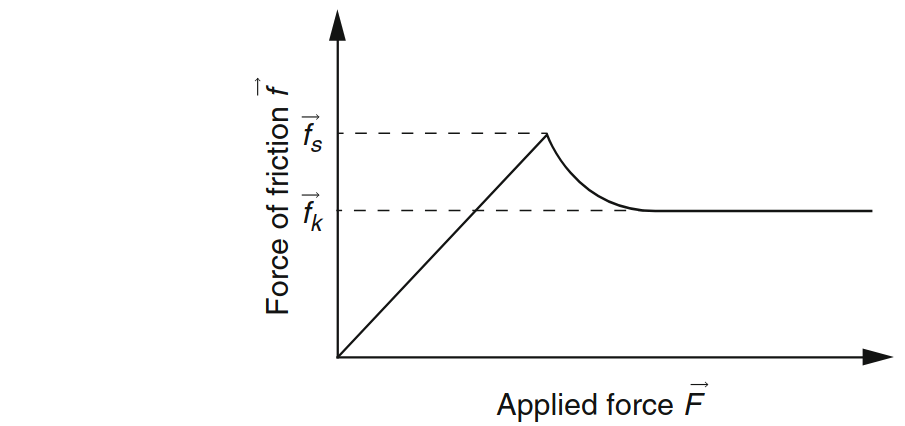
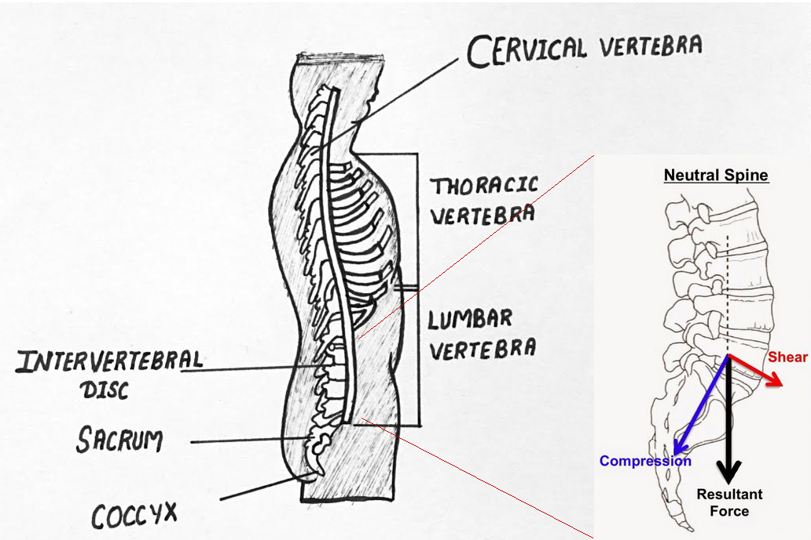
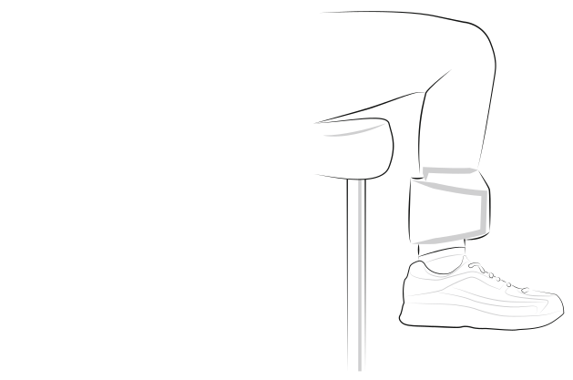
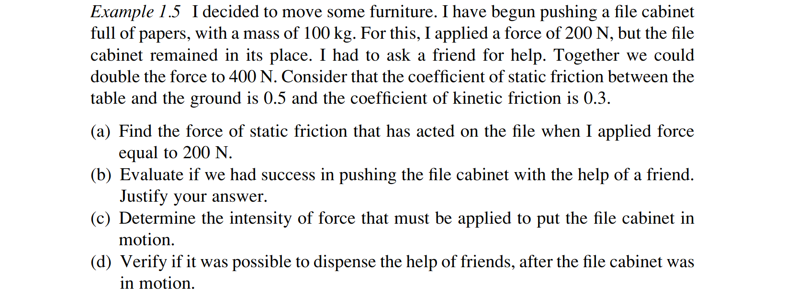
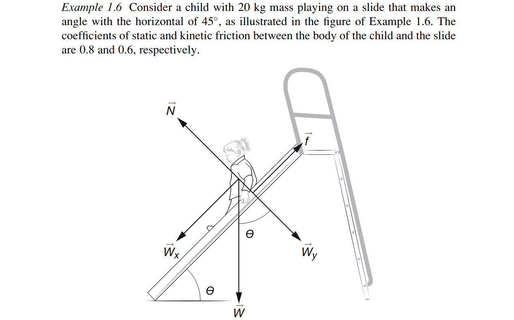

#+TITLE: BME Lecture 3: Friction
#+AUTHOR: Fethi Okyar
#+DATE: 2024-03-5
#+SUBTITLE: Readings from Okuna, Chapter 1
#+STARTUP: overview
#+REVEAL_THEME: simple
#+REVEAL_INIT_OPTIONS: slideNumber:"c/t", width:1920, height:1080
#+REVEAL_TITLE_SLIDE: <h2>%t</h2> <h3>%s</h3> <h4>%d</h4>
#+OPTIONS: timestamp:nil toc:1 num:nil
#+REVEAL_EXTRA_CSS: ../style.css
#+REVEAL_ROOT: https://cdn.jsdelivr.net/npm/reveal.js

* From the last lecture
#+ATTR_REVEAL: :frag (appear)
Ask *AI*:
#+ATTR_REVEAL: :frag (appear appear appear ...)
- How does friction affect the way we move around?
- Mechanical operations which owe their existence to friction
  
* Another mysterious effect of the nature: Friction
#+ATTR_REVEAL: :frag (appear)
is a force that appears on contact interfaces between two bodies, but differentiates from the normal component of the reaction force because it is bound to reside in the tangential plane of the contact surface.
#+ATTR_REVEAL: :frag (appear appear appear ...)
- the maximum available friction force is proportionally related with the normal component of the reaction force.
- The friction force decreases if motion (sliding) between the two bodies occur.

** 
#+ATTR_HTML: :width 900px
#+ATTR_HTML: :style align:center

The applied force is the component of the external force system resultant on the tangential plane of the interface, and the force of friction is the force that may be produced by the interface. If the applied force is larger than the friction force that may be produced, motion will begin.

** 
#+ATTR_REVEAL: :frag (appear)
$\mu_s$ the coefficient of static friction
$$ \boldsymbol{f}_s = \mu_s \boldsymbol{N} $$
#+ATTR_REVEAL: :frag (appear appear appear ...)
$\mu_k$ the coefficient of kinetic (dynamic) friction
$$ \boldsymbol{f}_k = \mu_k \boldsymbol{N} $$

* Example Problems
** Spinal mechanics

Discussion: Why do contact forces in a structure get larger as one moves in the direction of gravity? 
** Exercise 1.8 
#+ATTR_HTML: :width 700px
#+ATTR_HTML: :style align:center

$m_{leg} = 3.5$ kg

$m_{weight}=4.5$ kg

$m_{shoe}+m_{foot}=1.2$ kg

- What are the forces that act on the leg?
- Determine the resultant forces which must be compensated by the force acting on the knee articulation (joint)?
- Define the cylindrical joint, the joint axes, the degree(s)-of-freedom of the articulation

** Friction problems
*** Example 1.5
#+ATTR_HTML: :width 1400px
#+ATTR_HTML: :style align:center

*** Example 1.6
#+ATTR_HTML: :width 1400px
#+ATTR_HTML: :style align:center

* Questions for next session
Ask *AI*:
- to define the physical effect produced by the moment of a force
* Deliverables
By the end of this lecture students should be able to:
1. describe the nature of the friction force
2. resolve the contact reaction into its normal and tangential components
3. solve problems involving concurrent force system and friction
