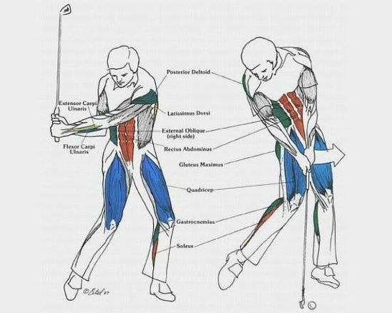

#+TITLE: BME Lecture 4: Concept of Torque
#+AUTHOR: Fethi Okyar
#+DATE: 2024-03-13
#+SUBTITLE: Readings from [[https://yulearn.yeditepe.edu.tr/mod/resource/view.php?id=215166][Okuna, Chapter 2]]
#+STARTUP: overview
#+REVEAL_THEME: simple
#+REVEAL_INIT_OPTIONS: slideNumber:"c/t", width:1920, height:1080
#+REVEAL_TITLE_SLIDE: <h2>%t</h2> <h3>%s</h3> <h4>%d</h4>
#+OPTIONS: timestamp:nil toc:1 num:nil
#+REVEAL_EXTRA_CSS: ../style.css
#+REVEAL_ROOT: https://cdn.jsdelivr.net/npm/reveal.js

* From the last lecture
#+ATTR_REVEAL: :frag (appear)
Ask *AI*:
#+ATTR_REVEAL: :frag (appear appear appear ...)
- resolving contact forces into their normal and tangential components: the role of the dot product operation in 3d
- relationship between the frictional loads and contact loads: the coefficient of friction
  
* The moment of a __
#+ATTR_REVEAL: :frag (appear)
The word ``moment'' has meanings that span
#+ATTR_REVEAL: :frag (appear appear appear ...)
- temporal
- spatial

** temporal
a moment in time...
#+ATTR_REVEAL: :frag (appear appear appear ...)
describes the time between an event and another. As in:
``Let's take a moment to remember the founder of the Republic of Turkey.''

** spatial
#+ATTR_REVEAL: :frag (appear)
There are various ways to take the moment of a geometric entity about another, e.g. the moment of area about a line.
#+ATTR_REVEAL: :frag (appear appear appear ...)
- this means we take the product of the area and the shortest distance between the geometric center of the area and the line.
- In class, we defined the concept of the geometric center, or the centroid, of a geometric entity, such as an area, by making use of the first moment using the following proposition:
- ``The product of the area integral and the distance between the centroid of the area to a reference axis should be equal to the integral of the product of the differential area element and the distance from it's centroid to the same reference axis.''
- Proofs were offered.

* The Moment of a Force (Torque)
#+ATTR_REVEAL: :frag (appear)
The moment of a force, $\boldsymbol{M}$, also known as torque, is a physical abstraction associated with the tendency of the force $\boldsymbol{F}$ to produce rotation around itself.
#+ATTR_REVEAL: :frag (appear appear appear ...)
- The torque (or moment) is a vector quantity (similar to a force), but in planar force systems it's magnitude ($M$) is sufficient to write equilibrium expressions.
- Given any point, $\boldsymbol{P}$, away from the force's line of action (LOA), the tendency to rotate is shown by curling the right hand's fingers around the point in the direction of the force
- In this case, the right hand's thumb indicate the direction of the resulting vector, $\boldsymbol{M}$.
- The magnitude of the resulting vector, $M$, is provided by the product of the shortest distance from the point to the force's LOA, $d_{\bot}$, and the force's magnitude, $F$.
  
** The cross-product operation
The cross (vector) product is a vector operation. It is different from the dot (scalar) product.
#+ATTR_REVEAL: :frag (appear appear appear ...)
- Take two vectors $\boldsymbol{a}$ and $\boldsymbol{b}$ as the operands.
- The cross product is defined by $\boldsymbol{a}\times\boldsymbol{b}$.
- This results is another vector $\boldsymbol{c}$.
- The magnitude of the result is given by the products of the magnitudes of the two vectors and the sine of the angle between them
  $$ c = a b \sin(\theta) $$.
- The direction of  $\boldsymbol{c}$ is perpendicular to the plane subtended by the two operands.
- The sense of the result is given by applying the right hand rule from the first to the second operand.

*** Example
#+ATTR_REVEAL: :frag (appear appear appear ...)
- cross-product between unit vectors
- cross-product between two arbitrary vectors
  perform vector product of (0.4,-0.4,0.2) and (-0.2,0.4,0.4)
- validate using octave online

*** Application to forces
#+ATTR_REVEAL: :frag (appear appear appear ...)
- the cross-product operation becomes handy to find the moment of a force about a point (or about an axis)

*** Example: Golf player
#+ATTR_HTML: :width 900px
#+ATTR_HTML: :style align:center

*** Coplanar force systems
#+ATTR_REVEAL: :frag (appear appear appear ...)
- reduction of dimensionality from three to two becomes possible under certain circumstances: when the position vectors and the external forces reside in a common plane.
- two-dimensional scenes offer considerable reduction in algebraic operations
  
* Questions for next session
Ask *AI*:
#+ATTR_REVEAL: :frag (appear appear appear ...)
- what is the difference between particle and rigid-body mechanics?
* Deliverables
By the end of this lecture students should be able to:
#+ATTR_REVEAL: :frag (appear appear appear ...)
1. calculate the area moment about an axis
2. determine the geometric center of an area
3. take the vector product between two vectors
4. apply the vector product operation to determine the moment of a force
5. find the moment of a force in coplanar force systems using simplified algebra 
