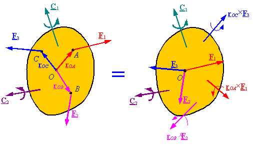
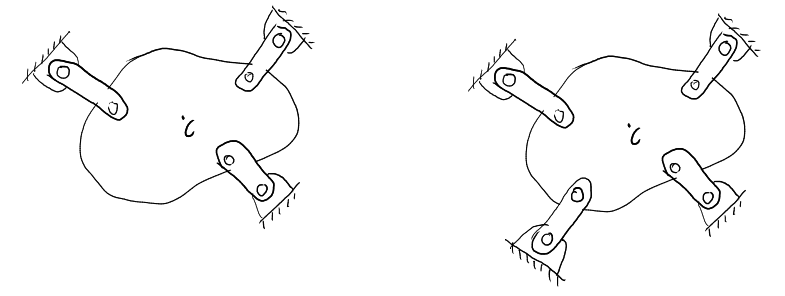

#+TITLE: BME Lecture 6: Static Equilibrium
#+AUTHOR: Fethi Okyar
#+DATE: 2024-03-24
#+SUBTITLE: Readings from [[https://yulearn.yeditepe.edu.tr/mod/resource/view.php?id=215169][Özkaya et al., Chapter 4]]
#+STARTUP: overview
#+REVEAL_THEME: simple
#+REVEAL_INIT_OPTIONS: slideNumber:"c/t", width:1920, height:1080
#+REVEAL_TITLE_SLIDE: <h2>%t</h2> <h3>%s</h3> <h4>%d</h4>
#+OPTIONS: timestamp:nil toc:1 num:nil
#+REVEAL_EXTRA_CSS: ../style.css
#+REVEAL_ROOT: https://cdn.jsdelivr.net/npm/reveal.js

* From the last lecture
#+ATTR_REVEAL: :frag (appear)
Ask *AI*:
#+ATTR_REVEAL: :frag (appear appear appear ...)
- how can a system of forces (acting on a rigid body) can simply be replaced with a force-couple pair?
- why is it important to move the forces to a common location from an equilibrium perspective?
  
* Static Equilibrium
#+ATTR_REVEAL: :frag (appear)
What was Newton's second law for a rigid body? (not a particle!)
#+ATTR_REVEAL: :frag (appear appear appear ...)
- analogous to the balance of linear momentum
  $$\boldsymbol{F}_R = [M]\boldsymbol{a}$$
  where $\boldsymbol{F}_R$ denotes the /resultant force/ at *a specified point* $O$ and $[M]$ is the mass matrix
- analogous to the balance of angular momentum
  $$\boldsymbol{M}_{R,O} = [I]\boldsymbol{\alpha}$$
  where $\boldsymbol{M}_{R,O}$ denotes the /resultant moment/ calculated with respect to the *same point* and $[I]$ is the inertia matrix

** equilibrium conditions
#+ATTR_REVEAL: :frag (appear)
Now going back to Newton's first law about an object at rest or steady motion...
#+ATTR_REVEAL: :frag (appear appear appear ...)
+ at any given point $O$ the satisfaction of the following two vector equations imply that a stationary object remains still (it is in a state of static equilibrium)
+ $$ \boldsymbol{F}_R = \sum_i \boldsymbol{F}_i = \mathbf{0} $$
+ $$ \boldsymbol{M}_{R,O} = \sum_j \boldsymbol{M}_j + \sum_i \boldsymbol{r}_{Oi} \times \boldsymbol{F}_i = \mathbf{0} $$
  where the $\boldsymbol{r}_{Oi}$ denotes the position vector from the specified point $O$ to the line of action of $\boldsymbol{F}_{i}$.
*** A General System of Forces
#+ATTR_HTML: :width 1000px

Note that point $O$ can be any point in or out of the body, it is not necessarily the centroid.
*** A Coplanar System of Forces
#+ATTR_HTML: :width 500px

** Free-Body Diagrams (FBDs)
#+ATTR_REVEAL: :frag (appear)
In analyzing the equilibrium we are interested in a single component or a sub-assembly of components only. In this case we isolate this region from it's surroundings by using the FBD concept. 
#+ATTR_REVEAL: :frag (appear appear appear ...)
+ Isolation at a contact interface results in revealing the contact force.
+ Isolation from a support (a mechanical joint) results in revealing the joint reaction load (JRL).
+ Isolation from the ground results in revealing the ground reaction force (GRF).
*** man pushing a file cabinet
#+ATTR_HTML: :width 800px

*** man pushing a file cabinet (FBDs)
#+ATTR_HTML: :width 800px

* Break
On a blank sheet of paper solve the following problems by yourself or in a group study session. 
** man-beam
Draw the FBD for the beam when the man is standing still. $C$ is the beam's center-of-gravity (COG).
  #+ATTR_HTML: :width 700px
  

How does the FBD change when the man starts walking to the right?
** over-hanging beam
Draw the FBD for the beam ($C$ is the COG)
  #+ATTR_HTML: :width 700px
  

* Analysis Procedure
#+ATTR_REVEAL: :frag (appear)
The procedure for analysing a mechanical system can be outlined as shown below:
#+ATTR_REVEAL: :frag (appear appear appear ...)
- Draw a simple, neat diagram of the system to be analyzed.
- Draw the free-body diagrams for all the bodies in the system.
- Show all the contact, joint and support reactions arising between bodies (try to guess the correct directions although not necessary to reach the solution).
- Adopt a proper coordinate system. Resolve all forces and moments into their components, and express the forces and moments in terms of their components.
- For each free-body diagram, apply the translational and rotational equilibrium conditions.
  + For a three-dimensional problem use
    $$  \boldsymbol{F}_R = \mathbf{0},\;\;  \boldsymbol{M}_{R,O} = \mathbf{0} $$
  + For a coplanar problem use
    $$ F_{x,R} = 0,\; F_{y,R} = 0,\; M_{z,R,O} = 0 $$
- Solve these equations simultaneously for the unknowns.

** Important Notes
#+ATTR_REVEAL: :frag (appear appear appear ...)
- Check the signs of the forces and moments while using their values in the equilibrium equations.
- Choose a proper point about which the moments should be calculated.
- No more than three independent equations can be generated for a coplanar system. These may either be
  $${F_x=0,\, F_y=0,\, M_O=0}$$ or
  $$(F_x=0\,\mathrm{or}\,F_y=0),\, M_O=0,\, M_P=0$$ or
  $$M_O=0,\, M_P=0,\, M_Q=0$$
  
** Some Simpler Coplanar Loadings
#+ATTR_REVEAL: :frag (appear)
There are some coplanar loadings that can be solved using less than three equation 
#+ATTR_REVEAL: :frag (appear appear appear ...)
- Two-force Members
- Paralel Force Systems
- Concurrent Force Systems (incl. three-force members)

*** Two-force Members
#+ATTR_REVEAL: :frag (appear)
The body is subjected a pair of tensile or compressive forces, usually gravity load is much smaller in comparison with these and can be neglected.

#+ATTR_HTML: :width 700px

#+ATTR_REVEAL: :frag (appear appear appear ...)
- Mechanical connections (say $P$ and $Q$) on both sides should be such that reactive moments can not be sustained (i.e. hinge, pin, or revolute joints).
- In this case, the line of action of the force system is necessarily aligned with the axis  $\overline{PQ}$.

*** Parallel Force Systems
#+ATTR_REVEAL: :frag (appear)
The body is subjected to a system of forces all of which are parallel to one another.

#+ATTR_HTML: :width 370px

#+ATTR_REVEAL: :frag (appear appear appear ...)
- In this case, we choose a set of coordinates, where one of the coordinate axes is aligned with the forces' line of action (say, $y$).
- The number of available equations reduces to two, we can either use
  $${F_y=0,\, M_O=0}$$ or
  $${M_O=0,\, M_P=0}$$

*** Concurrent Force Systems
#+ATTR_REVEAL: :frag (appear)
The body is subjected to a system of forces, whose lines of action intersect at a common point (the junction).

#+ATTR_HTML: :width 450px

#+ATTR_REVEAL: :frag (appear appear appear ...)
- In this case, the force system produces null (zero) moment about the junction, and the moment equation drops.
- The number of available equations reduce to the following pair: 
  $${F_x=0,\, F_y=0}$$

** Statical Indeterminacy
#+ATTR_REVEAL: :frag (appear)
This situation arises when the number of undetermined forces are more than the equations of static equilibrium.
#+ATTR_REVEAL: :frag (appear appear appear ...)
- For example, in the case of coplanar systems the number of available equilibrium equations is resctricted by 3. In that case the system on the left has three unknowns (which can be solved by using the three equations), but the one on the right has more unknowns compared to the number of equations and is thus termed as /a statically indeterminate system/.
  #+ATTR_HTML: :width 950px
  
- Solve for the link forces when a weight of 85 kg is hung. (Resolve the geometry using MS Paint and use Matlab online for all calculations.)
- If time allows solve the FBD questions in the Break

* Questions for next session
Ask *AI*:
#+ATTR_REVEAL: :frag (appear appear appear ...)
- Why and how are forces classified as active and reactive?
- What is the role of specific joint types in solving statical equilibrium problems, and how are the joint constraints related with the idea of degree of freedom? 
* Deliverables
By the end of this lecture students should be able to:
#+ATTR_REVEAL: :frag (appear appear appear ...)
1. to select appropriate equilibrium conditions
2. to sketch a free-body diagram with appropriate contact and support loads
3. to demostrate a systematic approach while solving statical equilibrium problems
4. to use the statical equilibrium conditions in order to generate equations
5. to solve these equations for the mechanical unknowns.
