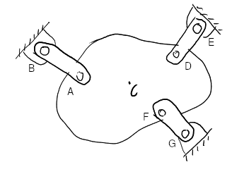
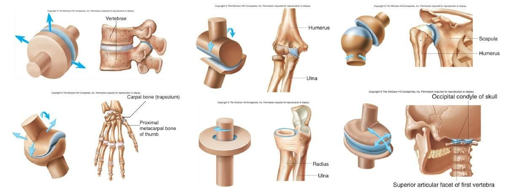

#+TITLE: BME Lecture 7: Constraints and Reactions
#+AUTHOR: Fethi Okyar
#+DATE: 2024-04-01
#+SUBTITLE: Readings from [[https://yulearn.yeditepe.edu.tr/mod/resource/view.php?id=215169][Özkaya et al., Chapter 4]]
#+STARTUP: overview
#+REVEAL_THEME: simple
#+REVEAL_INIT_OPTIONS: slideNumber:"c/t", width:1920, height:1080
#+REVEAL_TITLE_SLIDE: <h2>%t</h2> <h3>%s</h3> <h4>%d</h4>
#+OPTIONS: timestamp:nil toc:1 num:nil
#+REVEAL_EXTRA_CSS: ../style.css
#+REVEAL_ROOT: https://cdn.jsdelivr.net/npm/reveal.js

* From the last lecture
#+ATTR_REVEAL: :frag (appear)
Ask *AI*:
#+ATTR_REVEAL: :frag (appear appear appear ...)
- Why and how are forces classified as active and reactive?
- What is the role of specific joint types in solving statical equilibrium problems, and how are the joint constraints related with the idea of degree of freedom? 
  
* The Unfinished (3-link) Problem
Remember the problem of suspending a mass of 85-kg in-plane by three (3) links. The locations are determined graphically in pixel coordinates ( $x$ axis pointing to the right and the $y$ axis pointing downwards).
  #+ATTR_HTML: :width 650px
  
Code the problem so as to find the forces in each link. 
  
** A script to determine the unknown reaction force magnitudes
#+CAPTION: a small script in Octave

#+INCLUDE: "./script-3linkage.m" src octave

** Modified Problem?
Plot the variation of the linkage loads as the structure is turned 360$^\circ$ in its own plane.
#+BEGIN_SRC octave
  incr = 2*pi/36;
  for i = 0:1:35
    theta = i*incr;
    % solve matA * vecX = vecB
    % plot force magnitudes versus theta
    % (use polar plot ??)
#+END_SRC

* Mechanical Joints 
#+ATTR_REVEAL: :frag (appear)
There are various ways in which two parts can be connected mechanically. 
#+ATTR_REVEAL: :frag (appear appear appear ...)
- Roller
- Pivot
- Hinge
- Ball and Socket
- Gliding
- Saddle
- Ellipsiodal

** Notion of Relative Motion
In each type of joint, the relative motion between the connected parts is regulated in a different way.
#+ATTR_REVEAL: :frag (appear appear appear ...)
- In cartesian space the relative motion between two parts can be separated into six distinct components.
- There are three (3) translations (along the coordinate lines) and three (3) rotations (around the coordinate lines).
- We call a body to have six degrees-of-freedom in relation to another body, if there is no connection between them.
- When joints are used to relate the motion of bodies with respect to one another (e.g. to have a point of one body spatially rotate about a point in another body, i.e. the ball-and-socket type motion), we are in effect restricting (constraining) certain relative degrees-of-freedom.
- The motion constraints applied at the joints lead to the development of joint reaction loads (JRLs).
- In summary, the reason for the arisal of a reactive force in a particular direction at a joint is because of the motion restriction placed by the joint in that direction.

** Synovial Joints
These are mechanical joints found in our musculoskeletal system.
#+ATTR_HTML: :width 1900px

** Simpler (Planar) Joint Configurations 
#+ATTR_REVEAL: :frag (appear)
When the motion is planar, then the spatial constraint reduces to a planar one, which simplifies the problem.
#+ATTR_REVEAL: :frag (appear appear appear ...)
+ 
  #+ATTR_HTML: :width 1080px
   
  
** example: the cause of walking

As illustrated below,  a person is standing on a uniform, horizontal beam that is resting on frictionless knife-edge (wedge) and roller supports. Let $A$ and $B$ be two points where the knife-edge and roller supports contact the beam, $C$ be the center of gravity of the beam, and $D$ be a point on the beam directly under the center of gravity of the person. Assume that the length of the beam (the distance between $A$ and $B$) is $l = 5$ m, the distance between points $A$ and $D$ is $d = 3$ m, the weight of the beam is $W_1 = 900$ N, and the mass of the person is $m = 60$ kg.
#+ATTR_HTML: :width 450px
[[./fig-4.12_man-beam.png]]
#+ATTR_REVEAL: :frag (appear appear appear ...)
- Calculate the reactions on the beam at points $A$ and $B$.
- When the man initiates a gait-cycle (begins walking) towards the right  and a friction thrust force of 135 N accumulates at his feet, how do the reactions respond to this change?
- What is the source of this force?

* Break
#+ATTR_REVEAL: :frag (appear)
On the remaining part of our time some other biomechanical problems of interest will be studies. 
#+ATTR_REVEAL: :frag (appear appear appear ...)
- The Hamilton-Russell traction apparatus

* Traction apparatus for fracture healing

Consider the split Russel traction device and a mechanical model of the leg shown below. The leg is held in the position shown by two weights that are connected to the leg via two cables. The combined weight of the leg and the cast is $W = 300$ N. $l$ is the horizontal distance between points $A$ and $B$ where the cables are attached to the leg. Point $C$ is the center of gravity of the leg including the cast which is located at a distance two-thirds of $l$ as measured from point $A$. The angle cable 2 makes with the horizontal is measured as $\beta = 45$.
#+ATTR_HTML: :width 450px
 
#+REVEAL: split
#+ATTR_HTML: :width 550px
 
#+ATTR_REVEAL: :frag (appear appear appear ...)
- Determine the tensions $T_1$ and $T_2$ in the cables, weights $W_1$ and $W_2$, and angle $\alpha$ that cable 1 makes with the horizontal, so that no internal load occurs in the femur.

* Questions for next session
Ask *AI*:
#+ATTR_REVEAL: :frag (appear appear appear ...)
- Can you explain the mechanics of the gait-cycle? What does falling and rolling to do with walking?
- Provide a summary of the major movements we are able to do with our limbs, e.g. flexion/extension.
* Deliverables
By the end of this lecture students should be able to:
#+ATTR_REVEAL: :frag (appear appear appear ...)
1. write equilibrium equations from the free-body diagram,
2. solve the systems of equations for unknown reactions or other variables.
