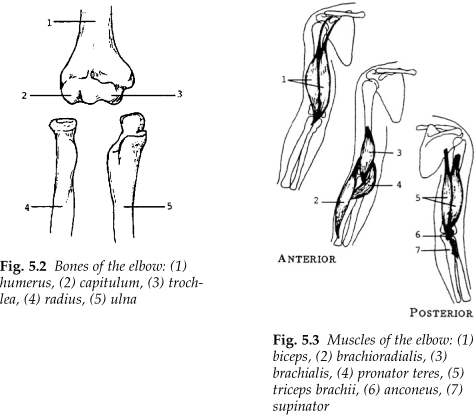
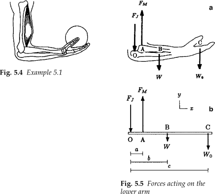

#+TITLE: BME Lecture 8: Biomechanics of the Upper Extremity
#+AUTHOR: Fethi Okyar
#+DATE: 2024-04-20
#+SUBTITLE: Readings from [[https://yulearn.yeditepe.edu.tr/mod/resource/view.php?id=215172][Özkaya et al., Chapter 5]]
#+STARTUP: overview
#+REVEAL_THEME: simple
#+REVEAL_INIT_OPTIONS: slideNumber:"c/t", width:1920, height:1080
#+REVEAL_TITLE_SLIDE: <h2>%t</h2> <h3>%s</h3> <h4>%d</h4>
#+OPTIONS: timestamp:nil toc:1 num:nil
#+REVEAL_EXTRA_CSS: ../style.css
#+REVEAL_ROOT: https://cdn.jsdelivr.net/npm/reveal.js

* From the last lecture
#+ATTR_REVEAL: :frag (appear)
Ask *AI*:
#+ATTR_REVEAL: :frag (appear appear appear ...)
- Can you explain the mechanics of the gait-cycle? What does falling and rolling to do with walking?
- Provide a summary of the major movements we are able to do with our limbs, e.g. flexion/extension.
  
* Articulations
Skeletal joints can be classified according to the degree of relative motion they permit. (Reading [[https://yulearn.yeditepe.edu.tr/mod/resource/view.php?id=215172][Section 5.1]]) 
#+ATTR_REVEAL: :frag (appear appear appear ...)
- Synarthroidal: no motion is permitted, a permanent type of joint
- Amphiarthroidal (symphysis): a small ROM (range of motion) is permitted
  + the vertebral joints
- Diarthroidal (synovial): a large ROM is permitted
  + The upper and lower limb motions are mostly due to these.
- [[https://openstax.org/books/anatomy-and-physiology-2e/pages/9-1-classification-of-joints]]
- Elsevier Complete Anatomy
  + [[https://bilgimerkezi.yeditepe.edu.tr/abone][Bilgi Merkezi]]

** [[https://openstax.org/books/anatomy-and-physiology-2e/pages/9-4-synovial-joints][Diarthroidal/Synovial Joints]]
  #+ATTR_HTML: :width 400px
   
  #+REVEAL_HTML: 

  #+ATTR_REVEAL: :frag (appear appear appear ...)
  1. Bones
  2. ligamentous capsule
  3. membrane
  4. synovial fluid
  5. articular cartilage
  6. menisci
  #+REVEAL_HTML: 

  
* Muscles
There are three types of muscles in our body
#+ATTR_REVEAL: :frag (appear appear appear ...)
- [[https://openstax.org/books/anatomy-and-physiology-2e/pages/10-7-cardiac-muscle-tissue][Cardiac Muscle]]: a special one that keeps your heart beating
- [[https://openstax.org/books/anatomy-and-physiology-2e/pages/10-8-smooth-muscle][Smooth Muscle]]: involuntary (autonomic nervous system), found in hollow organs, non-striated
- [[https://openstax.org/books/anatomy-and-physiology-2e/pages/10-2-skeletal-muscle][Skeletal Muscle]]: voluntary (central nervous system), attached to bones, striated
** Contractile Behavior  
  #+ATTR_REVEAL: :frag (appear appear appear ...)
The most important characteristic of skeletal muscles is their ability to contract under stimulation. Contraction is classified according to the direction of motion (flexion/extension). 
    #+ATTR_REVEAL: :frag (appear appear appear ...)
    * isometric (no change in posture)
    * eccentric (during limb extension)
    * concentric (during limb flexion)
    * ([[https://med.libretexts.org/Bookshelves/Anatomy_and_Physiology/Anatomy_and_Physiology_(Boundless)/9%3A_Muscular_System/9.3%3A_Control_of_Muscle_Tension/9.3E%3A_Types_of_Muscle_Contractions%3A_Isotonic_and_Isometric][types of muscle contration]])

** Functional Roles
Muscles are also characterized according to the role they play in motion.
    #+ATTR_REVEAL: :frag (appear appear appear ...)
    * Agonist
    * Antagonist
    * Synergist/Neutralizer
    * Fixator/Stabilizer
    * [[https://youtu.be/QAnEhz6Eqn4][E.g. muscle activity during the gait cycle]]

* Break

* General Approach
** Basic assumptions and limitations
#+ATTR_REVEAL: :frag (appear appear appear ...)
- The anatomical axes of rotation of joints are known.
- The locations of muscle attachments are known.
- The line of action of muscle tension is known.
- Segmental weights and their centers of gravity are known.
- Frictional factors at the joints are negligible.
- Dynamic aspects of the  problems will be ignored.
- Only two-dimensional problems will be considered.

** Method of Analysis
#+ATTR_REVEAL: :frag (appear appear appear ...)
- Identify major joints and motions
- Provide brief functional anatomy
- Construct a specific biomechanical problem
  #+ATTR_REVEAL: :frag (appear appear appear ...)
  + Upper extremity joints
  + Spinal mechanics
  + Lower extremity joints

* Upper Extremity, the Elbow
#+ATTR_REVEAL: :frag (appear appear appear ...)
- Mechanics of the Elbow
- Mechanics of the Shoulder

** Anatomy of the Joint
Muscles and bones around the elbow joint.
#+ATTR_HTML: :width 800px

** Holding a Ball (one-muscle)
Using only the dominant muscle (biceps)
#+ATTR_HTML: :width 800px

** The three-muscle version
The complexity is slightly increased by including the synergistic muscles (brachialis, brachioradialis)
#+ATTR_HTML: :width 400px

* Questions for next session
Ask *AI*:
#+ATTR_REVEAL: :frag (appear appear appear ...)
- Why is the shoulder joint usually considered to be the less stable joint among others?
  
* Deliverables
By the end of this lecture students should be able to:
#+ATTR_REVEAL: :frag (appear appear appear ...)
1. Differentiate among the types of muscle contractions
2. Distinguish between the functional and structural classifications for joints
3. Describe the bones that articulate together to form the elbow
4. Discuss the movements available at the elbow
5. Calculate the joint reaction forces and agonist muscle loads corresponding to a given movement.
